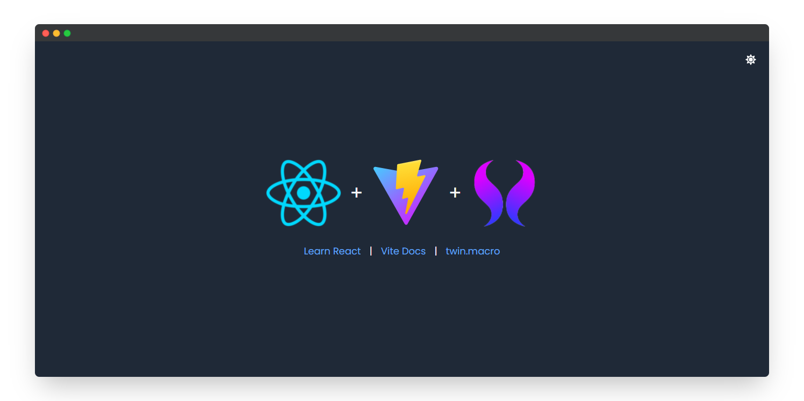

# React + Vite + twin.macro



## Getting Started

1. Clone this repository

   ```bash
   git clone https://github.com/hendraaagil/react-vite-twin-macro.git
   ```

2. Go to project directory and install all dependencies

   ```bash
   cd react-vite-twin-macro
   yarn # or npm install
   ```

3. Available scripts

   ```bash
   # Run development server
   yarn dev

   # Build project
   yarn build

   # Serve project
   yarn serve
   ```

## Learn More

- [React Documentation](https://reactjs.org)
- [Vite Documentation](https://vitejs.dev/guide)
- [twin.macro Documentation](https://github.com/ben-rogerson/twin.macro)
